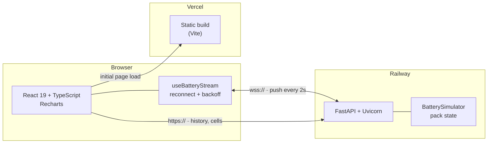

# ⚡ EV Battery Intelligence Dashboard

[](https://github.com/J4jatin/ev-battery-dashboard/actions/workflows/ci.yml)

A real-time monitoring dashboard for an electric-vehicle high-voltage battery pack.
Live telemetry is streamed over a WebSocket to a typed React frontend, alongside
cell-level health monitoring and interactive charts.

**[▶ Live Demo](https://ev-battery-dashboard-pi.vercel.app)**

---

## Architecture



**Why two transports.** The 24-hour history and the cell layout are fetched once
over REST because they do not change between renders. Pack telemetry changes
continuously, so it is pushed over a WebSocket instead of polled — one
connection replaces roughly 1,800 HTTP round-trips per hour per client.

---

## Tech Stack

| Layer | Technology |
| --- | --- |
| Frontend | React 19, TypeScript, Vite, Recharts |
| Backend | Python 3.11, FastAPI, Uvicorn, WebSockets |
| Testing | Vitest + React Testing Library, pytest |
| Quality | ESLint, `tsc`, Ruff |
| CI | GitHub Actions |
| Deployment | Vercel (frontend), Railway (backend) |

---

## Features

- **Live telemetry** — State of Charge, State of Health, voltage, current,
  temperature, power, cycle count and estimated range, pushed every 2 seconds.
- **Resilient streaming** — the connection reconnects automatically with
  exponential backoff (1s → 30s ceiling), and the status badge reports the real
  connection state instead of a hard-coded "LIVE".
- **24-hour charge history** — SOC and temperature trends on a combined chart.
- **Cell health monitor** — 12-cell pack view with per-cell voltage, temperature
  and fault highlighting.
- **Physically coupled model** — pack voltage is derived from state of charge
  (≈350 V empty, ≈420 V full) rather than generated independently.

---

## Running Locally

**Backend**

```bash
cd backend
pip install -r requirements-dev.txt
uvicorn main:app --reload            # http://localhost:8000
```

**Frontend**

```bash
cd frontend
cp .env.example .env
npm install
npm run dev                          # http://localhost:5173
```

### Configuration

| Variable | Side | Default | Purpose |
| --- | --- | --- | --- |
| `VITE_API_URL` | frontend | `http://localhost:8000` | Backend origin. The WebSocket URL is derived from it (`http`→`ws`, `https`→`wss`). |
| `ALLOWED_ORIGINS` | backend | `http://localhost:5173,http://127.0.0.1:5173` | Comma-separated CORS allowlist. |
| `STREAM_INTERVAL_SECONDS` | backend | `2` | Seconds between WebSocket pushes. |

> **Deploying:** set `VITE_API_URL` in the Vercel project settings and
> `ALLOWED_ORIGINS` in the Railway service variables before redeploying.

---

## Tests & Quality

```bash
# Frontend — 31 tests
cd frontend
npm run lint
npm run typecheck
npm run test
npm run test:coverage

# Backend — 22 tests
cd backend
ruff check .
ruff format --check .
pytest -q
```

Both suites run on every push and pull request via GitHub Actions.

**What is covered.** The backend tests assert *physical invariants* rather than
fixed values — SOC stays within bounds, temperature never exceeds the thermal
ceiling, voltage tracks state of charge, discharge current is negative, and
`power == V × |I| / 1000`. The frontend tests drive a mock WebSocket with fake
timers to verify the reconnect and backoff behaviour without a real network or
a sleeping test suite.

---

## API

| Method | Path | Description |
| --- | --- | --- |
| `GET` | `/health` | Liveness probe |
| `GET` | `/api/battery/status` | Current pack snapshot |
| `GET` | `/api/battery/history` | 24-hour history |
| `GET` | `/api/battery/cells` | Per-cell health |
| `WS` | `/ws/battery` | Live telemetry stream |

---

## Project Structure

```
backend/
  main.py                  FastAPI app: REST endpoints + WebSocket stream
  battery_simulator.py     Pack state model
  tests/                   pytest suite
frontend/src/
  api.ts                   Backend config + typed REST helpers
  types.ts                 Shared data contracts
  hooks/
    useBatteryStream.ts    WebSocket lifecycle, reconnect, backoff
  components/              MetricCard, ChargeHistoryChart,
                           CellHealthGrid, ConnectionBadge
  App.tsx                  Composition
.github/workflows/ci.yml   Lint, type-check, test, build
```

See **[STUDY_GUIDE.md](STUDY_GUIDE.md)** for the design decisions behind these
choices and the trade-offs involved.
