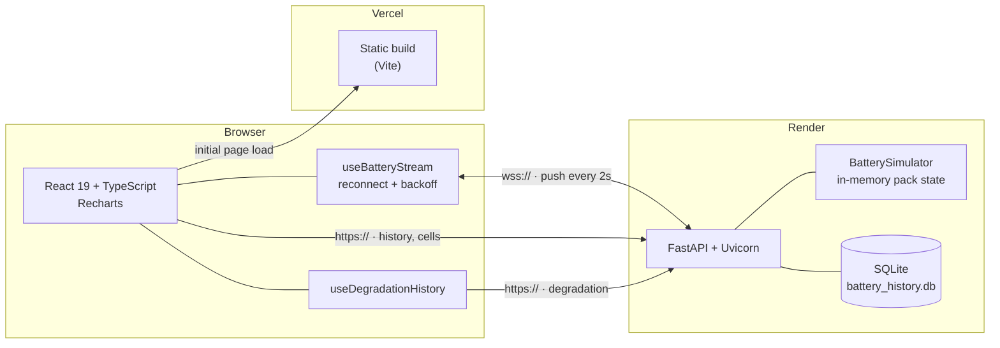

# ⚡ EV Battery Intelligence Dashboard

[](https://github.com/J4jatin/ev-battery-dashboard/actions/workflows/ci.yml)

A real-time monitoring dashboard for an electric-vehicle high-voltage battery pack.
Live telemetry is streamed over a WebSocket to a typed React frontend, alongside
cell-level health monitoring, interactive charts, and a SQL-backed view of real
NASA lab-measured battery degradation data.

**[▶ Live Demo](https://ev-battery-dashboard-pi.vercel.app)**

---

## Architecture



**Why two transports.** The 24-hour history and the cell layout are fetched once
over REST because they do not change between renders. Pack telemetry changes
continuously, so it is pushed over a WebSocket instead of polled — one
connection replaces roughly 1,800 HTTP round-trips per hour per client.

**Two different kinds of data.** The live telemetry (SOC, voltage, cell grid,
24h history) is simulated — generated by `BatterySimulator` with
`random.uniform()`, and clearly labelled as such. The degradation chart is not:
it is real, lab-measured capacity fade for four physical cells, served from a
bundled SQLite database. The UI keeps these visually and conceptually separate
(a "Reference Data" section, distinct heading, source citation) rather than
blending real and fake data into one indistinguishable feed.

---

## Tech Stack

| Layer | Technology |
| --- | --- |
| Frontend | React 19, TypeScript, Vite, Recharts |
| Backend | Python 3.11, FastAPI, Uvicorn, WebSockets |
| Database | SQLite (bundled, read-only reference data) |
| Testing | Vitest + React Testing Library, pytest |
| Quality | ESLint, `tsc`, Ruff |
| CI | GitHub Actions |
| Deployment | Vercel (frontend), Render (backend) |

---

## Features

- **Live telemetry** — State of Charge, State of Health, voltage, current,
  temperature, power, cycle count and estimated range, pushed every 2 seconds.
- **Resilient streaming** — the connection reconnects automatically with
  exponential backoff (1s → 30s ceiling), and the status badge reports the real
  connection state instead of a hard-coded "LIVE".
- **24-hour charge history** — SOC and temperature trends on a combined chart.
- **Cell health monitor** — 12-cell pack view with per-cell voltage, temperature
  and fault highlighting.
- **Physically coupled model** — pack voltage is derived from state of charge
  (≈350 V empty, ≈420 V full) rather than generated independently.
- **Real battery degradation chart** — cycle-by-cycle capacity fade for four
  real 18650 Li-ion cells from the NASA Ames PCoE dataset, queried from a
  bundled SQLite database and clearly marked as real data, not simulated.

---

## Real Data: NASA Battery Degradation Dataset

Everything else in this dashboard is simulated. The degradation chart isn't:
it's the [NASA Ames Prognostics Center of Excellence Li-ion Battery Data
Set](https://c3.nasa.gov/dashlink/resources/133/) (Saha, B., & Goebel, K.
(2007). *Battery Data Set*, NASA Ames Prognostics Data Repository) — four
18650 cells (B0005, B0006, B0007, B0018) cycled to end of life at room
temperature, with capacity measured on every discharge cycle. It's the same
dataset used in a large fraction of published battery state-of-health /
remaining-useful-life research.

**Pipeline.** `backend/scripts/build_battery_history_db.py` aggregates the raw
per-sample measurements (169k+ rows, ~21 MB) down to one row per (cell, cycle)
— 636 rows total — and writes them to a committed SQLite file,
`backend/data/battery_history.db` (52 KB). The FastAPI app only ever reads that
small pre-built file; it never touches the raw CSV at request time.

**Why SQLite instead of a managed database.** This data is static: NASA
stopped collecting it in 2008, so nothing about it changes at runtime. A
managed Postgres instance would need provisioning, a connection string, and
(on Render's free tier, which is what this project runs on) would be deleted
after 30 days of inactivity — a real constraint discovered while planning this
feature. A file committed alongside the code needs none of that, while still
being genuinely queried with SQL rather than loaded as a JSON fixture. See
`backend/battery_history.py` and `STUDY_GUIDE.md` for the full reasoning.

---

## Running Locally

**Backend**

```bash
cd backend
pip install -r requirements-dev.txt
uvicorn main:app --reload            # http://localhost:8000
```

**Frontend**

```bash
cd frontend
cp .env.example .env
npm install
npm run dev                          # http://localhost:5173
```

### Configuration

| Variable | Side | Default | Purpose |
| --- | --- | --- | --- |
| `VITE_API_URL` | frontend | `http://localhost:8000` | Backend origin. The WebSocket URL is derived from it (`http`→`ws`, `https`→`wss`). |
| `ALLOWED_ORIGINS` | backend | `http://localhost:5173,http://127.0.0.1:5173` | Comma-separated CORS allowlist. |
| `STREAM_INTERVAL_SECONDS` | backend | `2` | Seconds between WebSocket pushes. |

> **Deploying:** set `VITE_API_URL` in the Vercel project settings and
> `ALLOWED_ORIGINS` in the Render service's environment variables before
> redeploying. The Render free tier sleeps after 15 minutes of inactivity; a
> scheduled GitHub Actions workflow (`.github/workflows/keep-alive.yml`) pings
> `/health` every 10 minutes so the live demo link doesn't cold-start on a
> recruiter.

---

## Tests & Quality

```bash
# Frontend — 35 tests
cd frontend
npm run lint
npm run typecheck
npm run test
npm run test:coverage

# Backend — 32 tests
cd backend
ruff check .
ruff format --check .
pytest -q
```

Both suites run on every push and pull request via GitHub Actions.

**What is covered.** The backend tests assert *physical invariants* rather than
fixed values — SOC stays within bounds, temperature never exceeds the thermal
ceiling, voltage tracks state of charge, discharge current is negative, and
`power == V × |I| / 1000` — plus, for the real dataset, that SOH starts near
100%, degrades overall across a run, and that an unknown battery ID 404s. The
frontend tests drive a mock WebSocket with fake timers to verify the reconnect
and backoff behaviour without a real network or a sleeping test suite, and
mock the degradation endpoints to verify loading state, the default selection,
and switching between cells.

---

## API

| Method | Path | Description |
| --- | --- | --- |
| `GET` | `/health` | Liveness probe |
| `GET` | `/api/battery/status` | Current pack snapshot (simulated) |
| `GET` | `/api/battery/history` | 24-hour history (simulated) |
| `GET` | `/api/battery/cells` | Per-cell health (simulated) |
| `WS` | `/ws/battery` | Live telemetry stream (simulated) |
| `GET` | `/api/battery/degradation` | Summary stats for all four real cells |
| `GET` | `/api/battery/degradation/{battery_id}` | Full cycle history for one real cell (404 if unknown) |

---

## Project Structure

```
backend/
  main.py                        FastAPI app: REST endpoints + WebSocket stream
  battery_simulator.py           Simulated pack state model
  battery_history.py             Read-only SQLite access to real degradation data
  data/battery_history.db        Bundled NASA degradation dataset (committed, 52 KB)
  scripts/
    build_battery_history_db.py  Builds battery_history.db from the raw NASA CSV
  tests/                         pytest suite
frontend/src/
  api.ts                         Backend config + typed REST helpers
  types.ts                       Shared data contracts
  hooks/
    useBatteryStream.ts          WebSocket lifecycle, reconnect, backoff
    useDegradationHistory.ts     Fetches the real dataset + selected cell's cycles
  components/                    MetricCard, ChargeHistoryChart, CellHealthGrid,
                                  ConnectionBadge, DegradationChart
  App.tsx                        Composition
.github/workflows/
  ci.yml                         Lint, type-check, test, build
  keep-alive.yml                 Scheduled ping to keep the Render backend warm
```

See **[STUDY_GUIDE.md](STUDY_GUIDE.md)** for the design decisions behind these
choices and the trade-offs involved.
